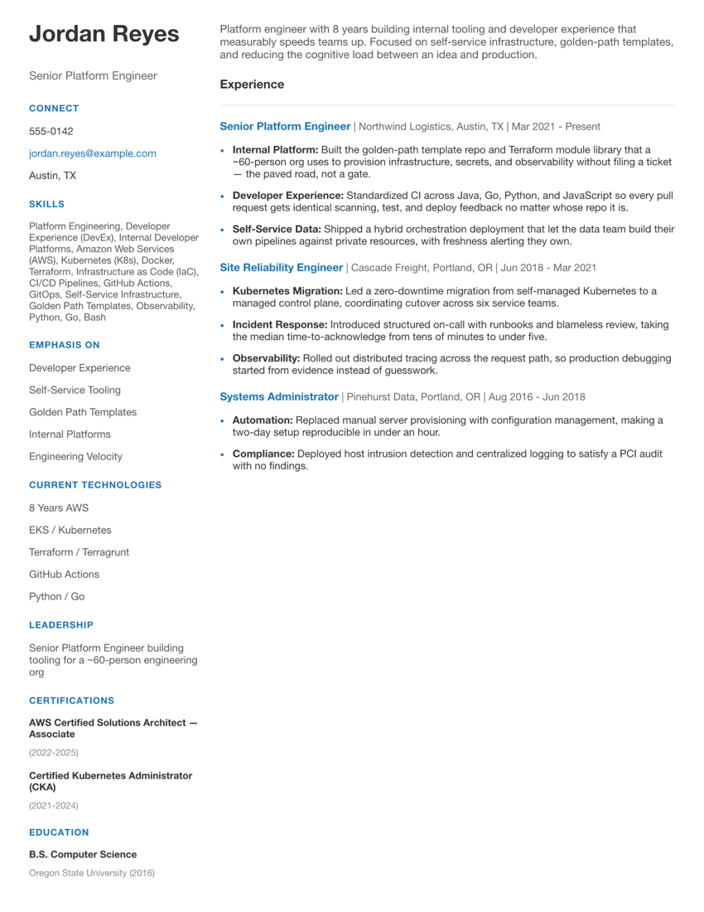

# job-hunt-template

[](https://github.com/tittle-xyz/job-hunt-template/actions/workflows/ci.yml)
[](LICENSE)

**Run your job hunt on your own machine: pull leads from 14 job boards into SQLite,
keep one set of facts about your career, and build a resume tailored to each role
from it.**

Use this when you're looking, you're tired of copying a Word file called
`resume_final_v3_ACTUAL.docx`, and you'd rather your applications lived in git than
in a folder on your desktop.

It's not a skeleton. It's a working tool with a CLI, 14 sources, a resume
generator, tests, and CI. Clone it and you get a real PDF in about a minute —
the resume below is built from the example profile that ships in this repo.



*One page, generated from `profile.example/`. The person is invented; the layout
and the pipeline are the real ones.*

> **New to the code?** [`docs/TOUR.md`](docs/TOUR.md) walks one full run through it,
> file by file.

## Start

```sh
gh repo create my-job-hunt --template tittle-xyz/job-hunt-template --private --clone
cd my-job-hunt
make install
make init
make resume ROLE=platform
```

**Make it private.** Your job hunt is nobody's business — not your employer's, not
your coworkers'. `--private` above does that. The tool keeps your side of the
bargain: everything about you lives in `profile/`, which is gitignored from the
first commit, so your details can't be published by accident.

`make init` copies `profile.example/` to `profile/` and asks for your name and
email. Then edit `profile/profile.yaml` — that's your career — and
`profile/search.yaml` — that's what you're looking for.

You'll also want [Typst](https://github.com/typst/typst) for PDFs
(`brew install typst`) and Python 3.11+. `make install` will tell you if either is
missing.

## The idea

Two files, doing two different jobs.

**`profile/profile.yaml` is facts.** Who you are, where you worked, what you did.
It doesn't change between applications.

**`profile/roles/*.yaml` is emphasis.** For *this kind of job*, what do you lead
with? It overlays the facts — a different title, a different summary, and it can
re-pitch any job's bullets by `id`.

The shipped example has two roles over one history. Same person, same jobs, same
truth:

| | `roles/platform.yaml` | `roles/sre.yaml` |
|---|---|---|
| The current job, pitched as | "the paved road, not a gate" | "alerting that pages a human only when a human helps" |
| Leads with | Developer Experience, Golden Path Templates | System Reliability, Incident Response |

Nothing is invented between them. The on-call work is in `profile.yaml` either
way; the SRE config just moves it into the light. That's the whole trick: write
your career down once, honestly, and aim it.

```sh
make resume ROLE=platform && make resume ROLE=sre    # then diff the PDFs
```

## Finding leads

```sh
make ingest                  # every source in profile/search.yaml
make list                    # newest first
make stats                   # counts by status and source

job-hunt search kubernetes
job-hunt show 42
job-hunt status 42 applied --notes "referred by Sam"
```

Leads land in SQLite at `data/jobs.db` and carry a status: `new` → `reviewed` →
`applied` / `rejected` / `archived`. Re-running `make ingest` never resets a status
you set — your triage is yours.

### Sources

Most need no account. Edit `sources:` in `profile/search.yaml` to pick.

| Source | Auth | Notes |
|---|---|---|
| `remoteok`, `remotive`, `workingnomads`, `himalayas`, `jobicy` | none | remote boards |
| `wwr` | none | We Work Remotely; one feed per category |
| `hn`, `hn_jobs` | none | Hacker News "Who's Hiring" and job posts |
| `ashby` | none | asks named companies directly — the list *is* the search |
| `linkedin` | none | scraped, so brittle by nature |
| `builtinco` | none | **Colorado only** |
| `usajobs` | key | **US federal only** |
| `adzuna` | key | location search |
| `findwork` | key | remote/startup |

Keyed sources skip themselves when the key is absent, so it's safe to leave them
enabled. See [`.env.example`](.env.example).

Adding one is a function that returns job dicts, plus an entry in `FETCHERS`. See
[`.claude/skills/add-job-source`](.claude/skills/add-job-source/SKILL.md).

## Why it's built this way

**The filter reads job titles, and nothing else.** Not descriptions, not tags.
Both were measured and both failed: description matching returned 10 hits out of
100 RemoteOK jobs and *all ten* were false positives — a Social Media Manager whose
posting says "infrastructure", a Servpro ad that mentions "reliability". Tags were
no better; six identical "Staff Software Engineer, Product" posts matched an `aws`
tag. A title is a claim about what the job *is*. A description merely mentions
things. The cost is real and named in `search.yaml`: **list the titles you'd
accept, not the tools you know.**

**The default nudges toward platform and infrastructure work.** A default is the
strongest recommendation a template gets to make, so it makes one. Change it; it's
a nudge, not a fence.

**It tells you when the resume spills.** The layout is one page and overflows
quietly — Typst exits 0 and you get a single orphaned line on page two, which reads
worse than either a tight page or an honest two-pager. So the template reports its
own page count and the generator warns.

**No cover letter generator.** A resume is structured data and benefits from being
built. A cover letter that reads like it was assembled by a machine is worse than
no cover letter. [`cover_letters/template.md`](cover_letters/template.md) is a
template because that's the right amount of help.

**Three dependencies.** `urllib` does the HTTP, `sqlite3` does the storage, Typst
does the PDF. A tool you lean on during a stressful month shouldn't rot because a
dependency moved on.

**Everything about you is gitignored.** `profile/`, `data/`, `applications/`,
`leads/`, and generated PDFs. The tests run with no profile at all, which is how we
know a fresh clone works.

## Working with an agent

There's a [`CLAUDE.md`](CLAUDE.md) and skills under `.claude/skills/` for
[adding a job source](.claude/skills/add-job-source/SKILL.md) and
[tailoring a resume](.claude/skills/tailor-resume/SKILL.md). Tailoring is the part
worth doing with help: pointing an agent at a job posting and your `profile.yaml`
and asking which of your real work to lead with is a genuinely good use of one.

It can't invent experience you don't have, and shouldn't try. Everything it writes
should trace back to something in your profile.

## Development

```sh
make test     # 79 tests: no network, no API keys, no profile needed
make lint
make help
```

Tests use recorded fixtures in `tests/fixtures/`, so nothing depends on a job board
being up. If you widen the filter back to descriptions or tags, they'll tell you
why not to.

## License

Apache-2.0. See [LICENSE](LICENSE).
